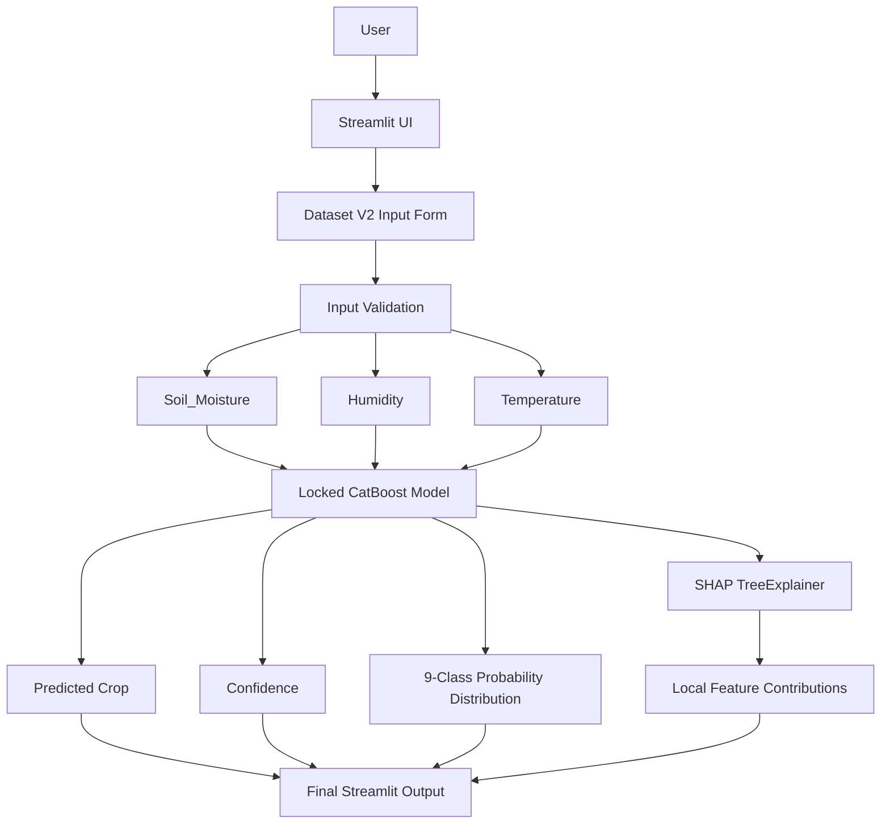
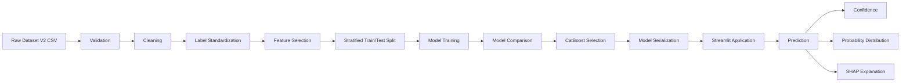
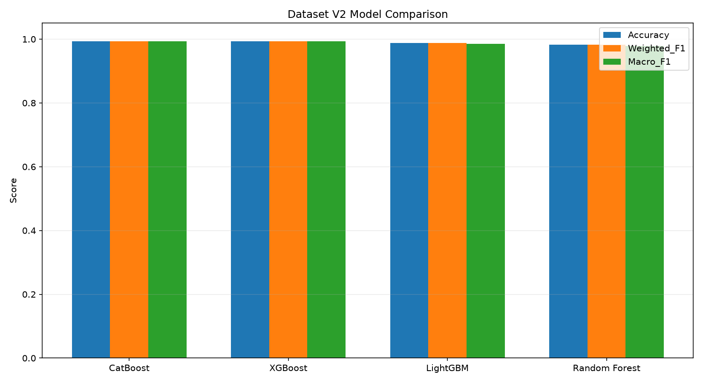
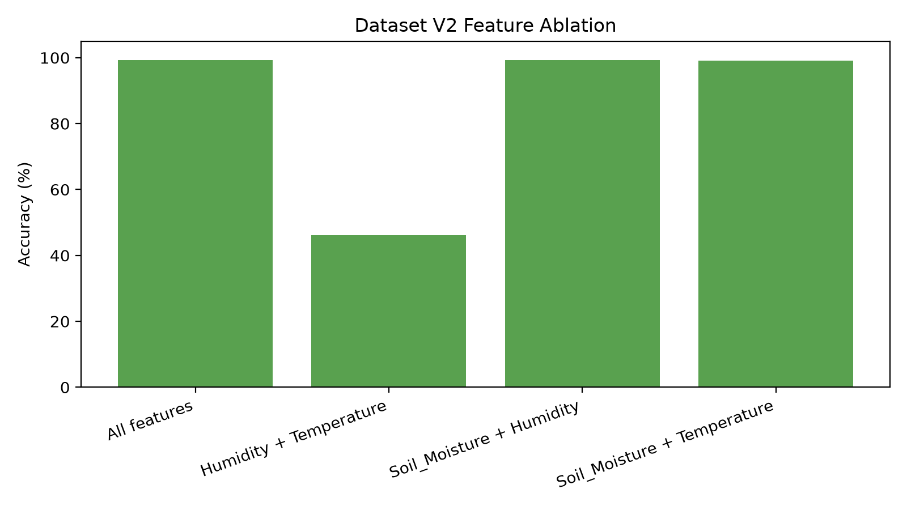
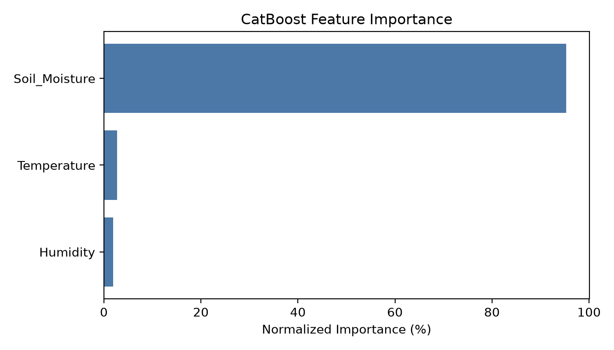
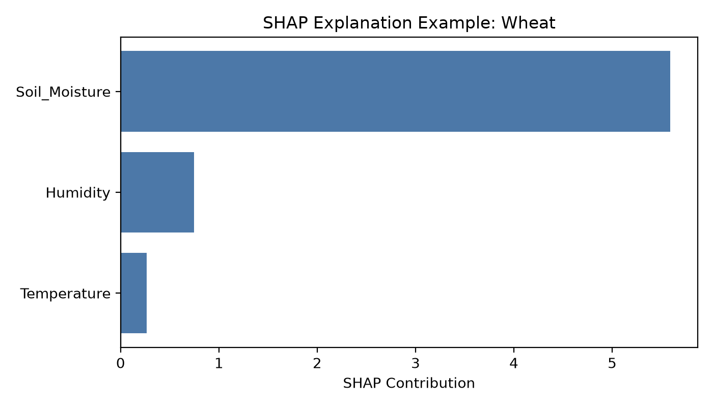
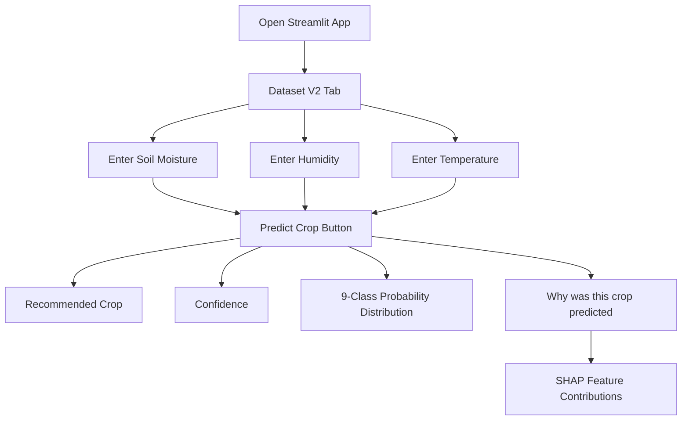

# Crop & Fertilizer Recommendation System

This repository contains a final-year machine learning project for crop recommendation. The final working application uses Dataset V2 with three environmental inputs, a locked CatBoost multiclass classifier, confidence output, 9-class probability distribution, and local SHAP explanation.

> Important: The final implemented application is a crop recommendation workflow. Fertilizer-related files exist in the repository from the original project scope, but fertilizer recommendation is not implemented in the final Dataset V2 Streamlit application.

## Table of Contents

- [1. Project Overview](#1-project-overview)
- [2. Problem Statement](#2-problem-statement)
- [3. Project Objective](#3-project-objective)
- [4. Final System at a Glance](#4-final-system-at-a-glance)
- [5. System Architecture](#5-system-architecture)
- [6. End-to-End Project Flow](#6-end-to-end-project-flow)
- [7. Dataset](#7-dataset)
- [8. Dataset Cleaning and Preprocessing](#8-dataset-cleaning-and-preprocessing)
- [9. Feature Description](#9-feature-description)
- [10. Crop Classes](#10-crop-classes)
- [11. Machine Learning Approach](#11-machine-learning-approach)
- [12. Model Comparison](#12-model-comparison)
- [13. Final Model](#13-final-model)
- [14. Final Performance](#14-final-performance)
- [15. Robustness and Ablation](#15-robustness-and-ablation)
- [16. Feature Importance](#16-feature-importance)
- [17. Explainable AI - SHAP](#17-explainable-ai---shap)
- [18. Application / Streamlit UI](#18-application--streamlit-ui)
- [19. Example Prediction](#19-example-prediction)
- [20. Project Structure](#20-project-structure)
- [21. Complete Installation Guide](#21-complete-installation-guide)
- [22. Quick Start](#22-quick-start)
- [23. No-Retraining Explanation](#23-no-retraining-explanation)
- [24. Running Development / Training Scripts](#24-running-development--training-scripts)
- [25. Review Milestones](#25-review-milestones)
- [26. Final Project Capabilities](#26-final-project-capabilities)
- [27. Limitations](#27-limitations)
- [28. Important Interpretation of 99.31%](#28-important-interpretation-of-9931)
- [29. Reproducibility](#29-reproducibility)
- [30. Verification Status](#30-verification-status)
- [31. If I Have Only 5 Minutes](#31-if-i-have-only-5-minutes)
- [32. Project Presentation - 30 Second Explanation](#32-project-presentation---30-second-explanation)
- [33. Project Presentation - Architecture Explanation](#33-project-presentation---architecture-explanation)
- [34. Questions Reviewers May Ask](#34-questions-reviewers-may-ask)
- [35. Key Numbers to Remember](#35-key-numbers-to-remember)
- [36. Paper Readiness](#36-paper-readiness)
- [37. Academic Integrity](#37-academic-integrity)
- [38. Future Work](#38-future-work)
- [39. License / Dataset Attribution](#39-license--dataset-attribution)

---

## 1. Project Overview

The project builds a machine-learning-based crop recommendation system. A user enters three Dataset V2 inputs:

- Soil Moisture
- Humidity
- Temperature

The locked CatBoost model predicts one of nine crop classes and the Streamlit application displays:

- recommended crop
- confidence percentage
- probability distribution across all nine crops
- SHAP-based local explanation for the current prediction

The final application is designed to run locally from the saved model artifact. A normal user does not need to retrain the model or rerun preprocessing to use the application.

---

## 2. Problem Statement

Crop recommendation can be treated as a supervised multiclass classification problem when historical crop labels and environmental measurements are available. The system uses soil/environmental features from Dataset V2 to predict a suitable crop class according to the learned patterns in that dataset.

The project does not claim guaranteed agricultural outcomes. The prediction is a model output based on the available dataset, and the final report explicitly documents limitations around dataset size, class imbalance, and strong dependence on Soil_Moisture.

---

## 3. Project Objective

The objective is to implement and validate a reproducible crop recommendation workflow that includes:

- dataset cleaning and preprocessing
- multiclass crop classification
- comparison of multiple machine learning models
- selection of a final CatBoost model using predefined metrics
- confidence and 9-class probability output
- local SHAP explainability
- a Streamlit application that runs from locked artifacts
- final evidence suitable for academic review and paper preparation

---

## 4. Final System at a Glance

| Component | Final Implementation |
| --- | --- |
| Language | Python |
| Main UI | Streamlit |
| Final Dataset | CropRec-BD Dataset V2 |
| Task Type | Multiclass crop classification |
| Input Features | Soil_Moisture, Humidity, Temperature |
| Crop Classes | 9 |
| Final Model | CatBoostClassifier |
| Models Compared | Random Forest, LightGBM, XGBoost, CatBoost |
| Explainability | SHAP TreeExplainer |
| Saved Model | `models/dataset_v2/crop_model_v2.pkl` |
| Saved Encoder | `models/dataset_v2/label_encoder_v2.joblib` |
| Final App | `app/app.py` |
| Normal App Execution | No retraining required |

---

## 5. System Architecture



The app also keeps a separate Review 1 tab for the earlier 12-feature soil-parameter prototype. The final Dataset V2 workflow is the main completed system.

---

## 6. End-to-End Project Flow



Normal application use starts at the serialized model and Streamlit app. The earlier preprocessing and training scripts are retained for reproducibility and evidence, not required for everyday app execution.

---

## 7. Dataset

Dataset V2 uses CropRec-BD v1, 2025. The repository stores the raw CSV at:

```text
data/dataset_v2/final_crops_data.csv
```

Verified Dataset V2 facts:

| Item | Value |
| --- | --- |
| Raw rows | 2,892 |
| Cleaned rows | 2,891 |
| Raw columns | Soil, Soil_Moisture, Humidity, Temperature, Crop Name |
| Final input features | Soil_Moisture, Humidity, Temperature |
| Excluded column | Soil |
| Target column | Crop Name |
| Number of classes | 9 |
| Train samples | 2,312 |
| Test samples | 579 |
| Split type | Stratified 80/20 |
| Random state | 42 |
| Raw dataset SHA-256 | `cfd15c93086a02991bcda90869537b8390794e98c6acc5c5e13f0b7c6c11afee` |

Source evidence:

- `data/dataset_v2/reports/preprocessing_summary.json`
- `data/dataset_v2/source_metadata_mendeley.json`
- `data/dataset_v2/validation_summary.json`

---

## 8. Dataset Cleaning and Preprocessing

The raw CSV was preserved. Cleaning was performed into separate cleaned artifacts under:

```text
data/dataset_v2/cleaned/
```

Actual preprocessing steps:

- selected `Soil_Moisture`, `Humidity`, `Temperature`, and `Crop Name`
- excluded the `Soil` column from the final Dataset V2 baseline
- checked missing/null-like values
- checked numeric feature validity
- removed one exact duplicate row from the cleaned copy
- standardized the label `Sugercane` to `Sugarcane`
- encoded labels with `LabelEncoder`
- created a stratified 80/20 train/test split with `random_state = 42`

Cleaned artifacts:

- `data/dataset_v2/cleaned/croprec_bd_clean.csv`
- `data/dataset_v2/cleaned/X_train.csv`
- `data/dataset_v2/cleaned/X_test.csv`
- `data/dataset_v2/cleaned/y_train.csv`
- `data/dataset_v2/cleaned/y_test.csv`
- `data/dataset_v2/cleaned/label_encoder.joblib`

---

## 9. Feature Description

| Feature | Description | Role |
| --- | --- | --- |
| Soil_Moisture | Soil moisture measurement available in Dataset V2 | Input |
| Humidity | Ambient humidity measurement available in Dataset V2 | Input |
| Temperature | Ambient temperature measurement available in Dataset V2 | Input |
| Crop Name | Crop class label used for supervised learning | Target |

These feature descriptions explain the dataset columns used by the model. They do not imply that any feature causally determines crop selection.

---

## 10. Crop Classes

| Encoded Label | Crop Class |
| ---: | --- |
| 0 | Banana |
| 1 | Jute |
| 2 | Maize |
| 3 | Mango |
| 4 | Pineapple |
| 5 | Potato |
| 6 | Strawberry |
| 7 | Sugarcane |
| 8 | Wheat |

---

## 11. Machine Learning Approach

Dataset V2 was treated as a supervised multiclass classification problem. Four models were evaluated on the fixed cleaned train/test split:

- Random Forest
- LightGBM
- XGBoost
- CatBoost

The workflow was:

```text
Training
-> Evaluation
-> Model comparison
-> Best model selection
-> Model serialization
-> Streamlit integration
```

No README claim is made that hyperparameter optimization was performed. The final locked model is used as-is by the application.

---

## 12. Model Comparison

The final metrics below come from:

```text
data/dataset_v2/reports/final_results.csv
```

| Model | Accuracy | Weighted F1 | Macro F1 |
| --- | ---: | ---: | ---: |
| Random Forest | 98.27% | 98.27% | 97.81% |
| LightGBM | 98.79% | 98.79% | 98.59% |
| XGBoost | 99.31% | 99.31% | 99.29% |
| CatBoost | 99.31% | 99.31% | 99.29% |

XGBoost and CatBoost both achieved 99.31% held-out accuracy. CatBoost was selected using the predefined selection criterion:

1. Macro F1
2. Weighted F1
3. Accuracy

Model comparison figure:



---

## 13. Final Model

| Item | Value |
| --- | --- |
| Final model | CatBoostClassifier |
| Model artifact | `models/dataset_v2/crop_model_v2.pkl` |
| Label encoder | `models/dataset_v2/label_encoder_v2.joblib` |
| Feature order | Soil_Moisture, Humidity, Temperature |
| Model SHA-256 | `76bf21ceed70955b66bb0b11c74f920d9b4cf5186d4f2894a64cd58313c51b4e` |
| Encoder SHA-256 | `706722a5bfdd18e7b40a86c18198c148b035f1ea55a3f10db047879ef51efee8` |

The exact feature order is important:

```text
Soil_Moisture
Humidity
Temperature
```

The prediction utility validates and constructs the model input in this order.

---

## 14. Final Performance

### Held-out Test Performance

The model achieved 99.31% accuracy on the held-out Dataset V2 test split.

Selected CatBoost held-out metrics:

| Metric | Value |
| --- | ---: |
| Accuracy | 99.31% |
| Weighted Precision | 99.32% |
| Weighted Recall | 99.31% |
| Weighted F1 | 99.31% |
| Macro Precision | 99.19% |
| Macro Recall | 99.40% |
| Macro F1 | 99.29% |
| Correct predictions | 575 / 579 |

### Cross Validation

Stratified 5-fold cross-validation was performed using the training data only. The held-out test set was not used during cross-validation.

| CV Metric | Value |
| --- | ---: |
| Mean Accuracy | 99.09% |
| Accuracy Std | 0.58% |
| Mean Macro F1 | 98.96% |
| Macro F1 Std | 0.73% |

Evidence:

- `data/dataset_v2/reports/cross_validation_results.csv`
- `data/dataset_v2/reports/cross_validation_summary.json`

---

## 15. Robustness and Ablation

The ablation study tested how performance changes when individual features are removed.

| Configuration | Features | Accuracy | Macro F1 | Weighted F1 |
| --- | --- | ---: | ---: | ---: |
| All features | Soil_Moisture, Humidity, Temperature | 99.31% | 99.29% | 99.31% |
| No Soil_Moisture | Humidity, Temperature | 46.11% | 39.18% | 43.54% |
| No Temperature | Soil_Moisture, Humidity | 99.31% | 99.29% | 99.31% |
| No Humidity | Soil_Moisture, Temperature | 99.14% | 99.05% | 99.14% |

Interpretation:

- Removing Soil_Moisture produced a large performance drop.
- The experiment indicates that Soil_Moisture is the dominant predictive feature in this dataset.
- This is not a causal claim.

Ablation figure:



---

## 16. Feature Importance

CatBoost feature importance for the final Dataset V2 model:

| Feature | Importance | Normalized Importance |
| --- | ---: | ---: |
| Soil_Moisture | 95.3105 | 95.31% |
| Temperature | 2.7514 | 2.75% |
| Humidity | 1.9381 | 1.94% |

Feature importance is model-specific evidence. It should not be interpreted as proof of causal agricultural relationships.



---

## 17. Explainable AI - SHAP

SHAP explains individual predictions by estimating how each input feature contributes to the model output for the predicted class.

Current implementation:

- library: `shap`
- explainer: `shap.TreeExplainer`
- model: locked Dataset V2 CatBoost model
- explained features: `Soil_Moisture`, `Humidity`, `Temperature`

The Streamlit app displays a local SHAP contribution table and bar chart below the crop probability distribution.

> SHAP estimates feature contributions to the model prediction. It does not prove causality and does not prove that a prediction is agronomically correct.

Example SHAP figure:



---

## 18. Application / Streamlit UI

Run the final app:

```cmd
streamlit run app\app.py
```

The application title is:

```text
Crop Recommendation System
```

The app contains:

- `Dataset V2` tab: final 3-feature CatBoost crop recommendation workflow
- `Review 1` tab: earlier 12-feature soil-parameter prototype

Dataset V2 UI flow:



Displayed output:

1. Recommended Crop
2. Confidence
3. Crop Probability Distribution
4. Why was this crop predicted?
5. SHAP feature contributions

---

## 19. Example Prediction

Verified example from `data/dataset_v2/reports/prediction_test.csv` and final validation:

| Input | Value |
| --- | ---: |
| Soil_Moisture | 44 |
| Humidity | 55.56 |
| Temperature | 29.58 |

Output:

| Output | Value |
| --- | --- |
| Predicted crop | Wheat |
| Confidence | approximately 96.62% |

CLI verification:

```cmd
python scripts\confidence_prediction.py --Soil_Moisture 44 --Humidity 55.56 --Temperature 29.58
```

---

## 20. Project Structure

Clean project structure, excluding `venv/`, cache folders, and temporary files:

```text
Crop-Fertilizer-Recommendation-System/
|-- app/
|   |-- app.py
|
|-- data/
|   |-- crop_dataset.csv
|   |-- fertilizer_data.csv
|   |-- fertilizer_dataset.csv
|   |-- processed/
|   |-- dataset_v2/
|       |-- final_crops_data.csv
|       |-- source_metadata_mendeley.json
|       |-- validation_summary.json
|       |-- cleaned/
|       |   |-- croprec_bd_clean.csv
|       |   |-- X_train.csv
|       |   |-- X_test.csv
|       |   |-- y_train.csv
|       |   |-- y_test.csv
|       |   |-- label_encoder.joblib
|       |-- reports/
|           |-- model_comparison.csv
|           |-- final_results.csv
|           |-- per_class_metrics.csv
|           |-- cross_validation_summary.json
|           |-- feature_ablation_results.csv
|           |-- feature_importance_v2.csv
|           |-- final_validation_summary.md
|           |-- final_project_validation.md
|
|-- images/
|   |-- dataset_v2/
|       |-- crop_distribution.png
|       |-- model_evaluation/
|           |-- model_comparison.png
|           |-- catboost_confusion_matrix.png
|           |-- feature_importance.png
|           |-- feature_ablation_results.png
|           |-- shap_explanation_example.png
|
|-- models/
|   |-- crop_model.pkl
|   |-- label_encoder.joblib
|   |-- random_forest.joblib
|   |-- lightgbm.joblib
|   |-- xgboost.joblib
|   |-- catboost.joblib
|   |-- dataset_v2/
|       |-- crop_model_v2.pkl
|       |-- label_encoder_v2.joblib
|
|-- scripts/
|   |-- confidence_prediction.py
|   |-- explain_prediction.py
|   |-- preprocess_dataset_v2.py
|   |-- train_evaluate_dataset_v2.py
|   |-- robustness_dataset_v2.py
|   |-- predict.py
|   |-- validate_dataset.py
|   |-- preprocessing.py
|   |-- feature_selection.py
|   |-- eda.py
|   |-- train_model.py
|   |-- evaluate_model.py
|   |-- load_dataset.py
|   |-- paths.py
|
|-- requirements.txt
|-- README.md
|-- .gitignore
```

---

## 21. Complete Installation Guide

Assume a new Windows laptop with Python and Git installed.

Clone the repository:

```cmd
git clone https://github.com/divakar-srinivasan/Crop-Fertilizer-Recommendation-System.git
cd Crop-Fertilizer-Recommendation-System
```

Create and activate a virtual environment:

```cmd
python -m venv venv
venv\Scripts\activate
```

Install dependencies:

```cmd
python -m pip install --upgrade pip
pip install -r requirements.txt
pip check
```

Run the app:

```cmd
streamlit run app\app.py
```

Open in browser:

```text
http://localhost:8501
```

---

## 22. Quick Start

```text
Clone repository
Create venv
Activate venv
Install requirements
Run Streamlit
Open localhost:8501
Enter Dataset V2 inputs
Click Predict Crop
```

Minimal command sequence:

```cmd
git clone https://github.com/divakar-srinivasan/Crop-Fertilizer-Recommendation-System.git
cd Crop-Fertilizer-Recommendation-System
python -m venv venv
venv\Scripts\activate
pip install -r requirements.txt
streamlit run app\app.py
```

---

## 23. No-Retraining Explanation

The repository includes the locked trained model artifact:

```text
models/dataset_v2/crop_model_v2.pkl
```

Therefore normal application execution does not require:

- preprocessing
- model training
- model comparison
- cross-validation
- ablation analysis

The user only installs dependencies and runs Streamlit. This makes the final application easier to reproduce on another laptop and avoids accidental changes to the locked result.

---

## 24. Running Development / Training Scripts

### Required for Normal Application Execution

Only this command is required after setup:

```cmd
streamlit run app\app.py
```

The app internally uses:

| File | Purpose |
| --- | --- |
| `app/app.py` | Streamlit user interface |
| `scripts/confidence_prediction.py` | Loads locked V2 model, validates inputs, predicts crop, returns confidence and probabilities |
| `scripts/explain_prediction.py` | Creates local SHAP explanation for the current V2 prediction |

### Used During Development / Experimentation

These scripts are retained for reproducibility and project evidence. They are not needed for normal app use.

| Script | Purpose | Command |
| --- | --- | --- |
| `scripts/preprocess_dataset_v2.py` | Clean Dataset V2 and create split artifacts | `python scripts\preprocess_dataset_v2.py` |
| `scripts/train_evaluate_dataset_v2.py` | Train/evaluate V2 baseline models and save reports/artifacts | `python scripts\train_evaluate_dataset_v2.py` |
| `scripts/robustness_dataset_v2.py` | Run V2 cross-validation, ablation, robustness checks | `python scripts\robustness_dataset_v2.py` |
| `scripts/confidence_prediction.py` | CLI confidence-aware V2 prediction | `python scripts\confidence_prediction.py --Soil_Moisture 44 --Humidity 55.56 --Temperature 29.58` |
| `scripts/explain_prediction.py` | CLI SHAP explanation for V2 prediction | `python scripts\explain_prediction.py --Soil_Moisture 44 --Humidity 55.56 --Temperature 29.58` |
| `scripts/predict.py` | Review 1 12-feature prediction CLI | `python scripts\predict.py --N ... --P ... --K ...` |
| `scripts/validate_dataset.py` | Review 1 dataset validation | `python scripts\validate_dataset.py` |
| `scripts/preprocessing.py` | Review 1 preprocessing | `python scripts\preprocessing.py` |
| `scripts/feature_selection.py` | Review 1 feature selection | `python scripts\feature_selection.py` |
| `scripts/eda.py` | Review 1 EDA outputs | `python scripts\eda.py` |
| `scripts/train_model.py` | Review 1 model training | `python scripts\train_model.py` |
| `scripts/evaluate_model.py` | Review 1 model evaluation | `python scripts\evaluate_model.py` |

---

## 25. Review Milestones

| Review | Scope | Status |
| --- | --- | --- |
| Review 1 | Initial dataset processing, EDA, baseline models, Review 1 Streamlit prediction | Complete |
| Review 2 | Dataset V2 confidence output, 9-class probabilities, SHAP local explanation | Complete |
| Review 3 | Final integration, validation, evidence consolidation, project freeze | Complete |

---

## 26. Final Project Capabilities

- [x] Dataset preprocessing
- [x] Feature selection for final V2 workflow
- [x] Model comparison
- [x] CatBoost multiclass classification
- [x] Crop prediction
- [x] Confidence estimation
- [x] 9-class probability distribution
- [x] SHAP local explainability
- [x] Streamlit application
- [x] Cross-validation
- [x] Ablation analysis
- [x] Feature importance analysis
- [x] Per-class evaluation
- [x] Reproducibility validation
- [x] Review 1 regression path retained
- [ ] Fertilizer recommendation in final app
- [ ] IoT integration
- [ ] Cloud deployment

Unchecked items are not currently implemented.

---

## 27. Limitations

The verified project limitations are:

1. Dataset V2 is relatively small with 2,891 cleaned samples.
2. Class imbalance exists across the nine crop classes.
3. Soil_Moisture has unusually strong crop separation in this dataset.
4. Model performance is dataset-dependent.
5. The result should not automatically be interpreted as real-world farm generalization.
6. Independent external field validation has not been performed.
7. Fertilizer recommendation is not implemented in the final Dataset V2 application.

These limitations are part of the final project evidence and should be openly discussed during review.

---

## 28. Important Interpretation of 99.31%

> Important: The reported 99.31% accuracy is the performance on the held-out Dataset V2 test split. It should not be interpreted as guaranteed real-world agricultural accuracy. The robustness analysis shows that the model is heavily dependent on Soil_Moisture in this dataset.

Use this wording in presentation:

```text
The model achieved 99.31% accuracy on the held-out Dataset V2 test split.
The result is dataset-dependent and strongly influenced by the crop-specific Soil_Moisture distribution.
```

---

## 29. Reproducibility

| Reproducibility Item | Verified Value |
| --- | --- |
| Random state | 42 |
| Final feature order | Soil_Moisture, Humidity, Temperature |
| Raw dataset preserved | Yes |
| Test set used during CV | No |
| Test labels used for hyperparameter tuning | No |
| Model artifact | `models/dataset_v2/crop_model_v2.pkl` |
| Encoder artifact | `models/dataset_v2/label_encoder_v2.joblib` |
| Requirements file | `requirements.txt` |
| Runtime paths | Project-relative |

Artifact hashes:

| Artifact | SHA-256 |
| --- | --- |
| Raw Dataset V2 CSV | `cfd15c93086a02991bcda90869537b8390794e98c6acc5c5e13f0b7c6c11afee` |
| X_train | `988e8bb1102d3314595f75ea662882c0e85d59b35a70d0f68ca51ecb22053322` |
| X_test | `c32b5560f02b1be83c7b7214c37c441212a5af137a81911138adf03f605890d5` |
| y_train | `d31b29d641fcee5b519f7a87bde201a1ae264d6aa52779144dba993a50ffc1aa` |
| y_test | `a7abf3c25c8d48de473477b4e7fd4409e55a4b39c8da6f80f52f87bee1d4ad1a` |
| Locked CatBoost model | `76bf21ceed70955b66bb0b11c74f920d9b4cf5186d4f2894a64cd58313c51b4e` |
| Label encoder | `706722a5bfdd18e7b40a86c18198c148b035f1ea55a3f10db047879ef51efee8` |

---

## 30. Verification Status

- [x] Application starts
- [x] Streamlit HTTP 200 verified
- [x] Prediction verified
- [x] Confidence verified
- [x] Probability distribution verified
- [x] SHAP verified
- [x] Model integrity verified
- [x] Dataset integrity verified
- [x] Requirements verified
- [x] Portability verified for runtime code
- [x] Review 1 regression verified
- [x] Review 2 regression verified
- [x] Review 3 final validation completed

Evidence files:

- `data/dataset_v2/reports/final_project_validation.md`
- `data/dataset_v2/reports/final_validation_summary.md`
- `data/dataset_v2/reports/robustness_summary.json`
- `data/dataset_v2/reports/test_set_sanity_report.json`

---

## 31. If I Have Only 5 Minutes

### 1. Problem

The project predicts a suitable crop class from available soil/environmental measurements using supervised machine learning.

### 2. Input

The final Dataset V2 app uses three inputs: Soil Moisture, Humidity, and Temperature.

### 3. Model

The final locked model is a CatBoost multiclass classifier trained on Dataset V2.

### 4. Output

The app recommends one of nine crops and shows confidence plus probabilities for all nine crop classes.

### 5. Explainability

SHAP explains the current prediction by estimating how each input feature contributes to the predicted crop.

### 6. Results

The model achieved 99.31% accuracy on the held-out Dataset V2 test split and 99.09% +/- 0.58% accuracy in 5-fold cross-validation on training data.

### 7. Application

The user runs `streamlit run app\app.py`, enters the three inputs, clicks Predict Crop, and reads the crop recommendation, confidence, probability table, and SHAP explanation.

### 8. Limitation

The most important limitation is that the result is dataset-dependent and strongly influenced by the crop-specific Soil_Moisture distribution. It is not guaranteed real-world farm accuracy.

---

## 32. Project Presentation - 30 Second Explanation

This project is a crop recommendation system built using Dataset V2. The user enters Soil Moisture, Humidity, and Temperature into a Streamlit application. A locked CatBoost multiclass model predicts one of nine crops, then the app displays the confidence, the probability distribution across all crop classes, and a SHAP explanation showing feature contributions for the prediction. The model achieved 99.31% accuracy on the held-out Dataset V2 test split, but the result is dataset-dependent and heavily influenced by Soil_Moisture, so it should not be claimed as guaranteed real-world accuracy.

---

## 33. Project Presentation - Architecture Explanation

First, the user opens the Streamlit application and selects the Dataset V2 workflow. The user enters Soil Moisture, Humidity, and Temperature. The input validation layer checks the values and creates a one-row feature frame in the exact model feature order. The locked CatBoost model loads from `models/dataset_v2/crop_model_v2.pkl` and generates class probabilities using `predict_proba()`. The highest-probability class becomes the recommended crop, and that probability is displayed as the confidence. The app then displays all nine crop probabilities. Finally, SHAP TreeExplainer estimates local feature contributions for the predicted crop and the app displays them as the explanation.

---

## 34. Questions Reviewers May Ask

### 1. Why did you select these features?

The final Dataset V2 baseline uses the verified cleaned features available in the selected dataset: Soil_Moisture, Humidity, and Temperature. The excluded `Soil` column was treated as redundant/categorical for the final baseline.

### 2. Why did you compare multiple models?

Multiple models were compared to avoid choosing a model without evidence. Random Forest, LightGBM, XGBoost, and CatBoost were evaluated on the same fixed Dataset V2 split.

### 3. Why did you select CatBoost?

CatBoost was selected using the predefined selection criterion: Macro F1 first, then Weighted F1, then Accuracy. CatBoost and XGBoost both achieved 99.31% accuracy, but CatBoost had the highest Macro F1 by the recorded comparison.

### 4. Why is the accuracy 99.31%?

The held-out Dataset V2 test split is highly separable, especially through Soil_Moisture. The robustness analysis shows that removing Soil_Moisture drops accuracy to 46.11%.

### 5. Is 99.31% real-world accuracy?

No. It is accuracy on the held-out Dataset V2 test split. It should not be treated as guaranteed real-world farm accuracy.

### 6. Why is Soil_Moisture so important?

Feature importance and ablation show that Soil_Moisture is the dominant predictive feature in this dataset. This is dataset evidence, not a causal agricultural proof.

### 7. What is SHAP?

SHAP is an explainability method that estimates how much each input feature contributes to an individual model prediction.

### 8. Why use Streamlit?

Streamlit provides a simple local web interface for demonstrating the final model, prediction confidence, probabilities, and SHAP explanation without building a separate frontend.

### 9. What happens when the user enters input?

The app validates the three values, builds a feature row in the required order, predicts using the locked CatBoost model, displays confidence and probabilities, then creates a local SHAP explanation.

### 10. Why not use deep learning?

The final dataset is small, tabular, and already works well with tree-based machine learning models. Deep learning was not necessary for the final validated workflow.

### 11. What is the train/test split?

Dataset V2 uses a stratified 80/20 split with 2,312 training samples and 579 test samples.

### 12. What is cross-validation?

Cross-validation evaluates model stability by splitting the training data into multiple folds. This project used stratified 5-fold cross-validation on the training data only.

### 13. What is the purpose of ablation?

Ablation tests how performance changes when features are removed. It showed that removing Soil_Moisture caused a large performance drop.

### 14. What are the limitations?

The dataset is relatively small, class imbalance exists, Soil_Moisture is unusually dominant, and no independent external field validation has been performed.

### 15. How is the project reproducible?

The repository includes the dataset artifacts, saved model, saved encoder, fixed feature order, random state, requirements file, reports, hashes, and validation evidence.

### 16. What happens if the model artifact is missing?

The prediction artifact loader raises a `FileNotFoundError`, and the Streamlit app displays a user-facing error message.

### 17. What are the nine crop classes?

Banana, Jute, Maize, Mango, Pineapple, Potato, Strawberry, Sugarcane, and Wheat.

### 18. What is the difference between prediction and confidence?

The prediction is the crop class with the highest probability. Confidence is that highest probability shown as a percentage.

### 19. What happens during normal application execution?

Normal execution loads the saved model and encoder, accepts user input, predicts the crop, displays confidence/probabilities, and generates a SHAP explanation. It does not retrain the model.

### 20. How can the project run on another laptop?

Clone the repository, create a virtual environment, install `requirements.txt`, and run `streamlit run app\app.py`. The saved model artifact is already included.

---

## 35. Key Numbers to Remember

| Item | Value |
| --- | --- |
| Raw Dataset Rows | 2,892 |
| Cleaned Rows | 2,891 |
| Features | 3 |
| Feature Names | Soil_Moisture, Humidity, Temperature |
| Crop Classes | 9 |
| Training Samples | 2,312 |
| Test Samples | 579 |
| Best Model | CatBoostClassifier |
| Held-out Test Accuracy | 99.31% |
| Held-out Macro F1 | 99.29% |
| CV Accuracy | 99.09% |
| CV Std | 0.58% |
| All-Feature Accuracy | 99.31% |
| Accuracy Without Soil_Moisture | 46.11% |
| Soil_Moisture Importance | 95.31% |
| Example Prediction | Wheat at approximately 96.62% confidence |

---

## 36. Paper Readiness

The project is ready for paper preparation and submission workflow. The repository contains evidence for:

- dataset description
- preprocessing
- model comparison
- held-out evaluation
- cross-validation
- ablation analysis
- feature importance
- SHAP explainability
- confusion matrix
- per-class metrics
- limitations
- reproducibility information

Main evidence summary:

```text
data/dataset_v2/reports/final_validation_summary.md
```

Final freeze scorecard:

```text
data/dataset_v2/reports/final_project_validation.md
```

This README does not claim that a paper has been accepted or that publication is guaranteed.

---

## 37. Academic Integrity

- Results are based on the documented Dataset V2 artifacts.
- The held-out test split was not used for cross-validation.
- Test labels were not used for hyperparameter tuning.
- No accuracy manipulation is reported.
- No synthetic samples, SMOTE, oversampling, or undersampling are claimed for the final result.
- Limitations are disclosed.
- Dataset provenance and licensing should be acknowledged in academic writing.

---

## 38. Future Work

The following are reasonable future extensions and are not currently implemented in the final application:

- independent external field validation
- broader agricultural datasets from multiple regions
- additional environmental and soil variables
- improved generalization testing
- optional fertilizer recommendation module
- optional deployment workflow

---

## 39. License / Dataset Attribution

Dataset source metadata in `data/dataset_v2/source_metadata_mendeley.json` identifies the dataset as:

```text
Appropriate Crop Recommendation Dataset for Cultivation in Bangladesh using IoT and Machine Learning (CropRec-BD v1, 2025)
```

Repository metadata records:

- Source: Mendeley Data
- DOI: `10.17632/dtf278skpw.1`
- License: CC BY 4.0
- Dataset file: `final_crops_data.csv`

The repository currently does not contain a software `LICENSE` file. Therefore, no software license is claimed here.

---

## Final Status

The project is frozen at the completed Dataset V2 crop recommendation workflow:

```text
Soil_Moisture + Humidity + Temperature
-> CatBoost crop prediction
-> confidence
-> 9-class probability distribution
-> SHAP local explanation
```

- Ready for paper preparation
- Normal use requires no retraining
